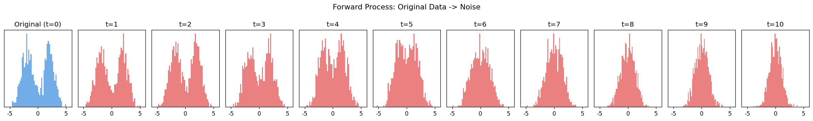
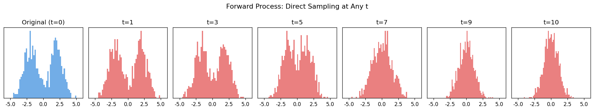
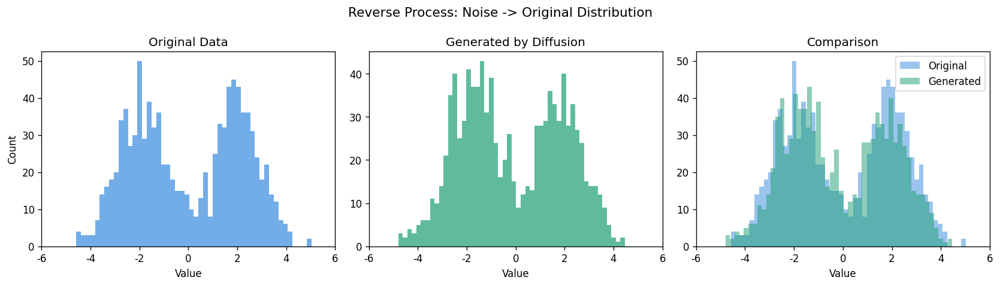
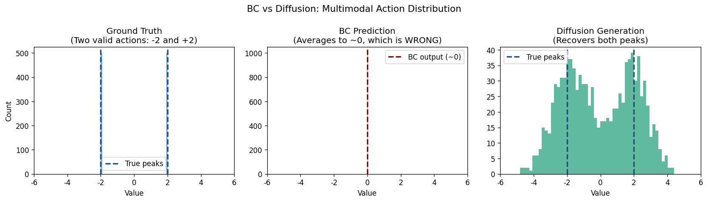

# 01. Diffusion Basics (DDPM)

---

## Why This Stage Exists

In `pytorch-bc-study`, two key limitations of Behavior Cloning were identified:

```
1. Distribution Shift  → BC collapses outside training distribution
2. Multimodal Problem  → BC averages over multiple valid actions → wrong output
```

This stage explores how Diffusion models solve the multimodal problem,
using a simple 1D toy experiment before moving to robot action generation.

---

## What Was Built

A minimal DDPM implementation on a 1D bimodal distribution,
covering the full pipeline from Forward Process to BC vs Diffusion comparison.

---

## Stage Breakdown

### Step 1 — Forward Process Visualization
Added noise step by step to a bimodal distribution.

```
Original (two peaks at -2 and +2)
    ↓ add noise × T steps
Pure Gaussian noise N(0,1)
```

Key insight: noise schedule β controls how fast the structure is destroyed.



---

### Step 2 — DDPM Math: Direct Sampling at Any t

Instead of applying noise step by step, compute x_t directly from x_0:

```
x_t = sqrt(α̅_t) * x_0 + sqrt(1 - α̅_t) * ε
```

Key insight: alpha_bar (cumulative product of alphas) allows jumping to any t in one step.

```
t=1:  99.0% signal remaining
t=5:  52.1% signal remaining
t=10:  4.2% signal remaining
```



---

### Step 3 — Noise Prediction Model Training

Trained a small MLP to predict the added noise ε given (x_t, t).

```
Input:  x_t (noisy data) + t (timestep embedding)
Output: predicted noise ε̂
Loss:   MSELoss(ε̂, ε)
```

Note: Diffusion loss naturally oscillates because different t values
have different difficulty levels — this is expected behavior.

---

### Step 4 — Reverse Process (Generation)

Starting from pure noise, iteratively removed noise using the trained model.

```
x_T ~ N(0,1)  (pure random noise)
    ↓ denoise × T steps
x_0  (generated sample)
```

Result: the bimodal structure was approximately recovered.



---

### Step 5 — BC vs Diffusion Comparison

The core experiment of this stage.

```
Same setup:
  Training data: two valid actions at -2 and +2
  Task: generate samples that match this distribution

BC result:     always outputs ~0  (average of -2 and +2 → wrong)
Diffusion:     generates both -2 and +2  (correct)
```



---

## Key Results

| | BC | Diffusion |
|--|----|----|
| Output for multimodal data | ~0 (average) | -2 or +2 (correct peaks) |
| Handles multimodal? | ❌ | ✅ |
| Reason | Deterministic model | Stochastic (starts from random noise) |

---

## Concepts Covered

| Concept | File |
|---------|------|
| DDPM core equations | [../00_concepts/ddpm_math.md](../00_concepts/ddpm_math.md) |
| Multimodal distribution | [../00_concepts/multimodal.md](../00_concepts/multimodal.md) |
| Deterministic vs Stochastic | [../00_concepts/deterministic_vs_stochastic.md](../00_concepts/deterministic_vs_stochastic.md) |
| Score function | [../00_concepts/score_function.md](../00_concepts/score_function.md) |
| U-Net architecture | [../00_concepts/unet.md](../00_concepts/unet.md) |

---

## Limitations of This Implementation

```
T = 10  (DDPM paper uses T = 1000)
  → Not enough steps for sharp separation of peaks

1D toy data
  → Real robot actions are high-dimensional
  → U-Net needed instead of simple MLP

No classifier-free guidance
  → Cannot condition generation on robot state
  → Next stage: Diffusion Policy
```

---

## Next Stage

[02_diffusion_policy](../02_diffusion_policy/README.md)
— Apply Diffusion to robot action generation (CartPole)
— Condition on observation (state → action)
— Compare with BC on CartPole directly
